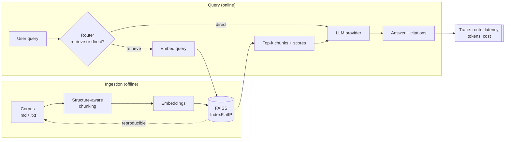

# Observable RAG

**A production-grade RAG service that treats retrieval as a system to be measured, not a demo.**
Provider-agnostic (Ollama / OpenAI / Anthropic), built on FastAPI + embeddings + FAISS,
with a real evaluation harness, per-request observability, and an agentic query router.

[](https://github.com/ronwsv/observable-rag/actions/workflows/ci.yml)


Most RAG examples stop at "embed, retrieve, prompt". In production the hard parts are the
ones around that: *is retrieval actually working?*, *what did this request cost and how long
did it take?*, *should we even retrieve for this query?*. Observable RAG is a compact, honest
reference implementation that answers those questions.

---

## Highlights

- **Provider-agnostic** — swap the LLM (Ollama, OpenAI, Anthropic, Google Gemini, AWS Bedrock)
  and the embedding backend by changing one environment variable. No framework lock-in; the
  retrieval layer is built directly on embeddings + FAISS.
- **MCP-ready** — the same RAG service is exposed as a Model Context Protocol server, so any
  MCP client (Claude Desktop, IDEs, agents) can call it as a tool.
- **Evaluated** — a labeled question set and an eval harness that measures retrieval
  (hit rate, MRR, precision@k) and, optionally, answer **faithfulness** via LLM-as-judge.
  The retrieval eval runs in CI on every push with a regression gate.
- **Observable** — every request emits one structured JSON trace: route taken, retrieved
  chunk ids, per-stage latency, token usage, and estimated cost. Optional Langfuse export.
- **Agentic routing** — an LLM router decides between *retrieve* and *answer directly*,
  skipping retrieval for small talk and degrading gracefully to a heuristic on any failure.
- **Grounded & cite-able** — the model is instructed to answer only from context and to
  return the source id for every claim.
- **Runs anywhere** — FAISS with a transparent NumPy fallback, and a dependency-free lexical
  embedding backend so tests, CI, and `docker run` work with no downloads, keys, or GPU.

## Architecture



## Quickstart

```bash
# 1. Install (core is enough to run with the lexical baseline)
pip install -e .
# add a semantic embedding backend for best quality:
pip install -e ".[local]"          # local sentence-transformers (free)
# and/or hosted providers:
pip install -e ".[openai]"  ".[anthropic]"
# optional LangChain retrieval backend:
pip install -e ".[langchain]"
# AWS Bedrock (Converse API + Titan embeddings):
pip install -e ".[bedrock]"
# Google Gemini (LLM + embeddings), the MCP server, and the LangGraph orchestrator:
pip install -e ".[gemini]"  ".[mcp]"  ".[langgraph]"

# 2. Configure (optional — sensible defaults ship in .env.example)
cp .env.example .env

# 3. Build the index from data/corpus
gaprag ingest

# 4. Ask a question
gaprag ask "What is RAG and when should I use it?"

# 5. Or run the API
gaprag serve            # http://127.0.0.1:8000/docs
```

Run fully offline with zero keys or downloads:

```bash
GAPRAG_EMBEDDING_PROVIDER=hash GAPRAG_LLM_PROVIDER=mock gaprag ask "What is chunk overlap?"
```

## Providers

Selected via environment variables; see [`.env.example`](.env.example).

| Kind | Options (`GAPRAG_*_PROVIDER`) | Notes |
|---|---|---|
| LLM | `ollama` (default), `openai`, `anthropic`, `bedrock`, `gemini`, `mock` | `mock` is offline & deterministic |
| Embeddings | `sentence_transformers` (default), `openai`, `bedrock`, `gemini`, `hash` | `hash` is a dependency-free lexical baseline |

**AWS Bedrock** uses the unified **Converse API** for generation (`us.anthropic.claude-*`,
Llama, etc.) and **Titan** for embeddings. Credentials come from the standard AWS chain
(environment, `~/.aws/credentials`, or an IAM role) — the code never handles keys. Set the
region with `GAPRAG_AWS_REGION`.

**Google Gemini** (via the unified `google-genai` SDK) provides both generation
(`gemini-2.0-flash`) and embeddings (`text-embedding-004`). Reads `GOOGLE_API_KEY` /
`GEMINI_API_KEY` from the environment.

## Evaluation

RAG is two systems, so it is measured in two places. See [`evals/`](evals/README.md).

**Retrieval** (no LLM needed, runs in CI). Latest run on the bundled question set
(`k=4`, 17 questions):

| Embedding backend | hit_rate@4 | MRR@4 | precision@4 |
|---|---|---|---|
| `hash` (lexical baseline) | **1.000** | **0.956** | 0.500 |
| `sentence_transformers` | run locally — `GAPRAG_EMBEDDING_PROVIDER=sentence_transformers python evals/run_eval.py` |

> **Honest note:** the evaluation questions are authored alongside the corpus, so they share
> vocabulary with it and the lexical baseline already scores highly. The point of this module
> is the *harness and methodology* — labeled data, versioned questions, metrics, and a CI gate.
> The natural next steps are paraphrased/adversarial questions and a semantic backend, which
> is exactly what the pluggable design is built for.

**Answer faithfulness** (optional, needs a real LLM):

```bash
GAPRAG_EVAL_GENERATION=1 GAPRAG_LLM_PROVIDER=ollama python evals/run_eval.py
```

## Observability

Every request emits one structured JSON line (and forwards to Langfuse if configured):

```json
{"event": "rag_request", "query": "What is MRR and what does it reward?",
 "request_id": "c166e42932a3", "route": "retrieve",
 "retrieved_ids": ["evaluating-rag-systems.md#4", "embeddings-and-vector-search.md#3"],
 "retrieval_ms": 0.64, "generation_ms": 0.41,
 "prompt_tokens": 559, "completion_tokens": 52, "total_tokens": 611,
 "model": "mock", "embedding_model": "hash-bow", "cost_usd": 0.0, "total_ms": 1.05}
```

The same trace is returned in the `/chat` response body, so a caller can see exactly how each
answer was produced.

## Agentic routing

Before retrieving, an LLM router picks a "tool":

- `retrieve` — search the knowledge base, then answer from the retrieved context.
- `direct` — answer without retrieval (greetings, small talk, reformatting).

The model must reply with strict JSON; if parsing fails for any reason, the router falls back
to a deterministic heuristic, so the pipeline never breaks on a bad model response.

The same flow is also available as an explicit **LangGraph** state machine (`route` node →
conditional edge → `retrieve`/`generate`), reusing the same components — a drop-in
orchestrator, not a rewrite. Needs the `[langgraph]` extra:

```bash
gaprag ask --graph "What is RAG and when should I use it?"
```

## Retrieval backends: native vs LangChain

Retrieval is built directly on FAISS by default (`GAPRAG_RETRIEVER=native`). An optional
LangChain backend (`GAPRAG_RETRIEVER=langchain`, needs the `[langchain]` extra) runs the
**same pipeline** on LangChain's FAISS vectorstore, reusing this project's own embeddings.

Both return identical rankings and scores for the same query — by design, since the pipeline
depends only on a small `retrieve(query, k) -> [RetrievedChunk]` contract:

```
QUERY: "What is MRR and what does it reward?"
native    : evaluating-rag-systems.md#4 (0.126), embeddings-and-vector-search.md#3 (0.105), ...
langchain : evaluating-rag-systems.md#4 (0.126), embeddings-and-vector-search.md#3 (0.105), ...
```

The point is architectural: the framework is a **swappable detail, not the architecture**.
Building retrieval directly on FAISS keeps full control and removes a heavy dependency; the
LangChain adapter shows the same result through the ecosystem's abstractions. Choose the tool
deliberately rather than being chosen by it.

## Model Context Protocol (MCP)

The same RAG service is exposed as an **MCP server**, so any MCP client (Claude Desktop,
IDEs, agents) can call it as a controlled tool rather than embedding a custom integration.
Two tools are published:

- `search_knowledge_base(query, k)` — semantic retrieval over the corpus.
- `answer_question(query)` — the full RAG pipeline, returning the answer with citations.

Run the server (needs the `[mcp]` extra and a built index):

```bash
gaprag mcp        # serves over stdio, the transport MCP clients expect
```

Register it with an MCP client — for example, Claude Desktop's config:

```json
{
  "mcpServers": {
    "observable-rag": { "command": "gaprag", "args": ["mcp"] }
  }
}
```

## Testing & CI

```bash
pytest                       # offline: hash embeddings + mock LLM
ruff check src tests evals   # lint
```

GitHub Actions runs lint, the test suite, and the retrieval eval (with a minimum hit-rate
gate) on every push — see [`.github/workflows/ci.yml`](.github/workflows/ci.yml).

## Docker

```bash
docker build -t observable-rag . && docker run -p 8000:8000 observable-rag   # offline, boots immediately
docker compose up --build                                      # full stack with local Ollama
```

CI/CD publishes the image to GHCR on every push to `main` (and on `v*` tags), so you can
also pull the prebuilt image:

```bash
docker run -p 8000:8000 ghcr.io/ronwsv/observable-rag:latest
```

## Project structure

```
src/gaprag/
  config.py         # env-driven settings
  chunking.py       # structure-aware markdown chunking
  store.py          # FAISS (+ NumPy fallback) vector store
  ingest.py         # corpus -> chunks -> embeddings -> index
  retriever.py      # embed query -> search (native FAISS)
  langchain_retriever.py  # optional LangChain FAISS backend (same interface)
  router.py         # agentic retrieve/direct decision
  rag.py            # orchestration + request tracing
  graph.py          # same flow as a LangGraph state machine
  observability.py  # structured traces, cost estimation
  api.py            # FastAPI service
  cli.py            # ingest / ask / serve / eval / mcp
  mcp_server.py     # exposes the RAG service as MCP tools
  providers/        # pluggable embedding & LLM backends
evals/              # dataset + harness + reports
tests/              # offline test suite
data/corpus/        # sample AI/LLM-engineering docs
```

## License

MIT © Ron Williams Viera
